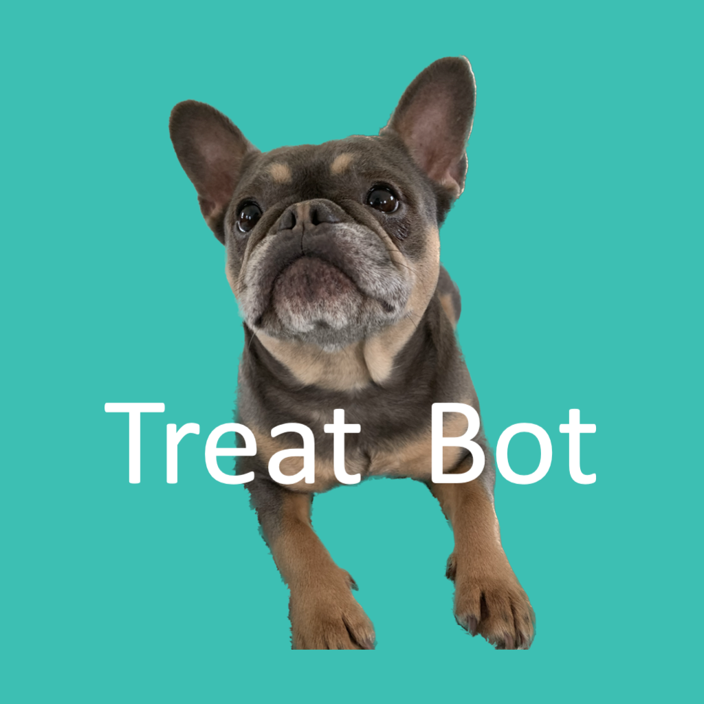

# Legends

## Definitions

**Type 2 Fun** *n.* — activities that are painful in the moment but fun in retrospect

**Type 2 Civilization** *n.* — a civilization that has achieved full mastery of its solar system

**Type 2 Labs** *n.* — a company bootstrapping a Type 2 Civilization, one insane, painful step at a time

## Mission 1: Chat, We're Going to The Moon

Type 2 Labs is putting a streaming rover on the moon. 

Streamers, Youtubers, Individuals, Oraganization -- anyone can take control.

We are currently building the rover prototype. Before we go to the moon, we need to fund the prototype and launch testing. 

## Sponsors

### 05 lvl

### 04 lvl

### 03 lvl

## Tier System

**Stages**
- α: Prototype

**Backing**
- 00: $1+           name, callsign
- 01: $10+          message
- 02: $100+         social url
- 03: $1,000+       03 sponsor, any url
- 04: $10,000+      04 sponsor
- 05: $100,000+     05 sponsor

## Legends Log

A list of legendary individuals and organizations backing our insane mission.

1. (α03) [pericles] William Edward Brennan III ~ Rover Commander in Chief
2. (α04) [treatbotgg] [Treat Bot](https://www.treatbot.gg) ~ Twitch connected treat dispenser
